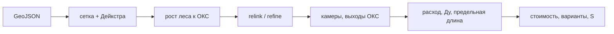

# Heating Routing Service

Сервис автоматического построения трасс подключения перспективных объектов
капитального строительства (ОКС) к существующей тепловой сети. Кейс «Лидеры
цифровой трансформации» 2026.

Сервис принимает один совмещённый GeoJSON, автоматически выбирает места
присоединения через тепловые камеры, строит новую сеть (с общими участками для
нескольких ОКС), считает расходы и подбирает условные диаметры (Ду) совместно с
предельной длиной по путям, учитывает пространственные ограничения и
спецпроходы, рассчитывает стоимость, формирует до трёх вариантов и выгружает
результат в GeoJSON.

Сервис **headless** (без UI) и работает **офлайн**; оценивается корректность
GeoJSON и расчёта, а не визуализация (см. [docs/index.md](docs/index.md)).

> Статус: **M2 (обязательная 2D-задача, ТП v2) реализована**; дополнительно
> реализован необязательный режим глубины **M4** (ADR-0073). Ведётся подготовка
> к финальной сдаче **M5**. См. [дорожную карту](docs/04-delivery/roadmap.md).

## Как работает алгоритм

Основной алгоритм — единый поиск по сетке `grid-forest` (ADR-0034):

1. **Поиск пути.** Строится растровая сетка проходимости (ячейка ≈1 м) с учётом
   запретных буферов и спецзон; многоисточниковый Дейкстра идёт от существующей
   сети, затем от неё «растёт» лес деревьев к точкам подключения ОКС.
2. **Топология.** Присоединение — только через тепловую камеру (существующую по
   правилу ≤10 м либо новую); общие стволы для нескольких ОКС; ветвления только
   в камерах, ≤4 примыканий (проходная линия = 2).
3. **Постобработка.** `relink` переприсоединяет и перестраивает топологию,
   `refine` чинит углы (≤90°), убирает зигзаги и самопересечения, выпрямляет
   спецучастки; положение и слияние камер оптимизируются, выход ОКС —
   канонический (`target→point`).
4. **Гидравлика.** Расходы суммируются от точек к присоединению; подбирается
   минимальный Ду, одновременно удовлетворяющий расходу и предельной длине по
   непрерывным путям.
5. **Стоимость и варианты.** Считаются участки, камеры, врезки и штрафы; до трёх
   содержательно разных вариантов ранжируются по `S`. Дополнительно —
   необязательный режим глубины (M4).



Подробно: [алгоритм](docs/03-architecture/algorithm.md),
[правила расчёта](docs/02-domain/calculation-rules.md),
[архитектурные решения (ADR)](docs/03-architecture/adr/README.md).

## Быстрый старт

Есть три равнозначных способа; для проверки достаточно первого.

### Только Docker (ничего ставить не нужно, кроме Docker)

```bash
docker compose up --build -d      # app + PostgreSQL/PostGIS
# API:        http://localhost:8080
# Swagger UI: http://localhost:8080/swagger-ui.html
# Health:     http://localhost:8080/actuator/health
docker compose down
```

### Make + JDK 11 (без nix/devenv)

Maven подтягивается автоматически через Maven Wrapper (`./mvnw`).

```bash
make db-up        # PostgreSQL + PostGIS из docker-compose
make build        # сборка jar
make test         # быстрые тесты
make run          # запуск сервиса (http://localhost:8080)
make verify       # полная проверка
make down         # остановить и удалить стек
```

Полный список команд: `make help`.

### devenv (Nix)

```bash
devenv shell      # Java 11, Maven, Node/pnpm, make, pdftotext/pandoc
devenv test       # smoke окружения
dev               # БД + приложение + визуализатор (Ctrl+C — стоп)
```

devenv-скрипты (`build`, `test`, `dev`, `db-up`, `fe-up`, …) — тонкие обёртки
над соответствующими целями `make`.

### Локальный запуск приложения

БД поднимается только через docker-compose (ADR-0017) на TCP `localhost:5432`
(БД/пользователь `heating`); devenv БД не запускает.

```bash
make db-up
make run
```

### API и Swagger

- Swagger UI: http://localhost:8080/swagger-ui.html (спецификация —
  http://localhost:8080/v3/api-docs).
- Разделы: `Dataset` (загрузка), `Runs` (запуск/статус/результат/этапы),
  `Algorithms`, `Service`; описания операций и моделей — по ADR-0075.
- Быстрая проверка: `GET /api/v1/info` (версия сборки), `GET /api/v1/algorithms`.
- Визуализатор встраивает Swagger UI во вкладку «API» (ADR-0072).

## Команды (Makefile)

| Команда | Назначение |
|---------|------------|
| `make help` | Список команд |
| `make compile` / `build` | Компиляция / сборка jar без тестов |
| `make test` / `test-slow` | Быстрые / полные (slow) тесты |
| `make verify` | Полная проверка Maven |
| `make run` | Локальный запуск сервиса |
| `make fe-install` / `fe-dev` / `fe-build` / `fe-test` | Визуализатор (опционально) |
| `make fe-basemap` / `fe-basemap-style` / `fe-assets` | Офлайн-подложка карты (PMTiles, глифы, спрайты, стили) |
| `make licenses` | Отчёт о лицензиях зависимостей (`target/licenses/`) |
| `make db-up` / `db-down` / `db-logs` | Контейнер БД |
| `make up` / `fe-up` / `stop` / `down` / `ps` | Docker-стек (app+db, опц. frontend) |
| `make compose-config` | Проверка `docker-compose.yml` |
| `make dev` | БД + приложение + визуализатор |
| `make deploy` | Развёртывание стека (app + db + визуализатор) |

## Пример через API (curl)

Сервис должен быть запущен (`make db-up && make run` или
`docker compose up --build -d`). Пример использует исторический образец
`source/data_example.geojson`; для «боевого» прогона —
`source/Датасет скорректированный.geojson`. Для разбора JSON нужен `jq`.

```bash
# 1. Загрузить датасет (multipart/form-data, поле file)
DATASET_ID=$(curl -s -F "file=@source/data_example.geojson" \
  http://localhost:8080/api/v1/datasets | jq -r .id)
echo "dataset: $DATASET_ID"

# 2. Запустить расчёт (algorithm / mode / trace необязательны)
RUN_ID=$(curl -s -X POST \
  "http://localhost:8080/api/v1/datasets/$DATASET_ID/runs?algorithm=grid-forest&mode=2d&trace=false" \
  | jq -r .id)
echo "run: $RUN_ID"

# 3. Отслеживать статус: PENDING/RUNNING → DONE/PARTIAL/FAILED
curl -s "http://localhost:8080/api/v1/runs/$RUN_ID" | jq '{status, stage, progress}'
# потоком:
watch -n 1 "curl -s http://localhost:8080/api/v1/runs/$RUN_ID | jq '{status,stage,progress}'"

# 4. Скачать результат (GeoJSON, формат заказчика)
curl -s -o result.geojson "http://localhost:8080/api/v1/runs/$RUN_ID/result"
```

Полезное:

- `mode=depth` — отдельный режим с учётом глубины (ADR-0073);
- `trace=true` — сохранить промежуточные этапы (`GET /runs/{id}/stages`);
- список алгоритмов: `curl -s http://localhost:8080/api/v1/algorithms | jq`;
- без `jq` id извлекается так:
  `... | grep -o '"id":"[^"]*"' | head -1 | cut -d'"' -f4` или
  `python3 -c 'import sys,json;print(json.load(sys.stdin)["id"])'`;
- ожидание завершения циклом:
  `while [ "$(curl -s http://localhost:8080/api/v1/runs/$RUN_ID | jq -r .status)" = "RUNNING" ]; do sleep 1; done`.

## Фронтенд-визуализатор (опционально)

Отдельное SPA для проверки результата: карта, параметры объектов, сравнение
вариантов, просмотр промежуточных этапов алгоритма. **Не входит в оцениваемую
поставку** (ADR-0013).


```bash
make fe-install
make fe-dev        # http://localhost:5173 (proxy /api → :8080)
make fe-build
make fe-test
```

Через Docker (весь стек app + db + визуализатор):

```bash
make fe-up         # docker compose --profile frontend up --build -d
make stop          # остановить контейнеры (без удаления)
make down          # остановить и удалить стек
```

Визуализатор: http://localhost:8081, сервис: http://localhost:8080.

Офлайн-подложка карты готовится скриптами: `make fe-basemap`
(полный экстракт Москвы и области, `BBOX`/`MAXZOOM`/`PROTOMAPS_DATE`) или
`make fe-basemap-placeholder` (быстрый z≤6), стили — `make fe-basemap-style`.
Подробнее — [frontend/public/basemap/README.md](frontend/public/basemap/README.md).

Визуализатор открывает GeoJSON результата напрямую (без backend) и запускает
расчёт через API, в том числе дополнительный режим глубины
`POST /api/v1/datasets/{id}/runs?mode=depth` (ADR-0073). При расчёте через
сервис доступна постадийная трассировка (`?trace=true`) с вкладками этапов
(ADR-0036…0038); данные этапов — `GET /api/v1/runs/{id}/stages[/{stageId}]`.
Офлайн-подложка PMTiles — `frontend/public/basemap/README.md`.

## Документация

Начните с [docs/index.md](docs/index.md). Ключевое:

- [Устав](docs/01-project/charter.md), [требования](docs/01-project/requirements.md).
- [Правила расчёта](docs/02-domain/calculation-rules.md), [модель данных](docs/02-domain/data-model.md).
- [Архитектура](docs/03-architecture/overview.md), [алгоритм](docs/03-architecture/algorithm.md), [ADR](docs/03-architecture/adr/README.md).
- [Дорожная карта](docs/04-delivery/roadmap.md), [backlog](docs/04-delivery/backlog.md).
- Пакет сдачи: [чек-лист](docs/06-submission/checklist.md), [пояснительная записка](docs/06-submission/explanatory-note.md), [структура презентации](docs/06-submission/presentation-outline.md), [скриншоты](docs/06-submission/screenshots/README.md), [лицензии](docs/06-submission/licenses.md) / [THIRD_PARTY_NOTICES](THIRD_PARTY_NOTICES.md).

## Стек

Java 11 · Spring Boot 2.6.3 · Maven (Wrapper) · PostgreSQL 16 + PostGIS ·
springdoc-openapi-ui 1.7.0 · docker-compose · JTS · Proj4J.
Визуализатор: React 18 + TypeScript + Vite + MapLibre (LTS).

## Структура репозитория

```
src/main/java/ru/lct/heating/   # код (пакеты по фичам, см. overview.md)
src/main/resources/             # application*.yml, schema.sql
src/test/                       # тесты
frontend/                       # опциональный визуализатор (React/MapLibre)
docs/                           # проектная документация
source/                         # ТЗ, ТП v2, разъяснения, датасеты, регламенты
scripts/                        # генераторы наборов и утилиты
Makefile                        # единый интерфейс команд
mvnw / .mvn/                    # Maven Wrapper
THIRD_PARTY_NOTICES.md          # лицензии сторонних компонентов
devenv.nix                      # среда разработки (опционально)
Dockerfile / docker-compose.yml # контейнеризация
.github/workflows/ci.yml        # CI: backend + frontend + compose
```

## Исходные материалы

См. папку [`source/`](source/): описание кейса, ТП v2, разъяснения, протокол
встречи, основной датасет, регламенты конкурса и шаблон презентации. Состав и
приоритет источников — в [docs/index.md](docs/index.md).

## Лицензия и данные

Расчёт полностью офлайн, без обращения к внешним сервисам. Секреты и большие
датасеты в репозиторий не коммитятся.

## История изменений

| Дата | Изменение | Автор |
|------|-----------|-------|
| 2026-09-16 | Первоначальная версия | команда |
| 2026-09-16 | Добавлен протокол встречи в исходные материалы | команда |
| 2026-09-19 | Обновлён статус M1, добавлены разделы запуска приложения и фронтенд-визуализатора | команда |
| 2026-09-19 | Единая БД через docker-compose; devenv без Postgres (ADR-0017) | команда |
| 2026-09-19 | Добавлен скрипт `fe-up` для запуска всего стека с визуализатором | команда |
| 2026-09-19 | Надёжная остановка: скрипт `stop`, `down` через stop + `down --remove-orphans` (podman-compose) | команда |
| 2026-09-22 | ADR-0036: opt-in поэтапная трассировка (`?trace=true`, API `/runs/{id}/stages`) и вкладки этапов в визуализаторе | команда |
| 2026-09-29 | ADR-0073: дополнительный режим глубины `?mode=depth` | команда |
| 2026-09-29 | Визуализатор: выбор режима `2D/Глубина` (ADR-0073), запоминание в localStorage | команда |
| 2026-09-29 | M5: Makefile (единый интерфейс), Maven Wrapper, CI, devenv-обёртки; актуализирован README; регламенты конкурса и пакет сдачи | команда |
| 2026-09-29 | API: описания OpenAPI/Swagger (ADR-0075), build-info в `/api/v1/info`, тест контракта | команда |
| 2026-09-29 | M5: make-цели подложки (`fe-basemap*`, `fe-assets`) и `licenses`; скриншоты в `docs/06-submission/`; THIRD_PARTY_NOTICES | команда |
| 2026-09-29 | README: тезисное описание алгоритма (mermaid + ссылки), пример через API (curl), скриншот визуализатора | команда |
