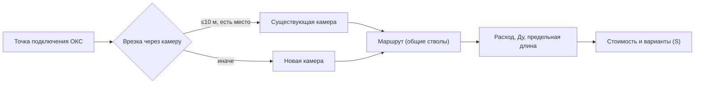

# Анализ задачи

Сжатое изложение кейса (`source/2. ДИТ.pdf`) с уточнениями ТП v2
(`source/Техническое  приложение ЛЦТ v2.docx`), разъяснений 18.09.2026 и
протокола встречи 16.09.2026. Полные правила — в
[calculation-rules.md](calculation-rules.md), форматы — в
[data-model.md](data-model.md).

## 1. Контекст

Новые здания подключают к системе теплоснабжения: для каждой точки подключения
определяют место присоединения к существующей сети и маршрут прокладки в
плотной городской застройке. Число вариантов быстро растёт — нужна
автоматизация.

## 2. Что автоматизируем

1. Тепло идёт по паре труб (подающая + обратная) одного Ду; на карте — линия.
2. Дана конкретная точка подключения (`oks_connection_point` с `flow_tph`);
   полигон ОКС — это ограничение `oks`, оно не задаёт маршрут.
3. Выбирается место присоединения к существующей сети — **через тепловую
   камеру** (существующую или новую).
4. Строится маршрут; несколько точек могут использовать общий участок.
5. Учитываются ограничения: обход, минимальные расстояния, спецпроходы.
6. Расход участка — сумма расходов точек «ниже»; подбирается Ду.
7. Варианты сравниваются по стоимости и длине.

## 3. Упрощения базовой модели

- Один источник; ограничение мощности и полный гидравлический расчёт не
  рассматриваются.
- Топология по `upstream_object_id` не требуется; текущие расходы/резерв
  существующей сети не определяются.
- Одна линия = пара труб одного Ду.
- Каждая часть новой сети присоединяется к существующей через камеру.
- От присоединения до каждой точки — ровно один путь (без замкнутых маршрутов).
- Обязательная часть — 2D; глубина — отдельный необязательный режим.
- Прокладка подземная бесканальная.
- Геометрия существующей сети не проверяется.
- Масштаб: тысячи объектов, объём до 2–3 ГБ.

## 4. Структура новой сети

- Общие участки для нескольких точек (суммарный расход), разделение при
  ветвлении.
- Разветвления — только в камерах; ≤4 примыкающих линейных участка;
  существующая проходная линия занимает 2 примыкания.
- Новая камера обязательна в каждой точке разветвления; стоимость включает
  присоединение.
- Присоединение к существующей камере — 5 000 000 руб. за каждый новый участок.
- Технический узел — только при смене параметра без разветвления, без стоимости.
- Геометрия: прямые участки, повороты произвольные до 90° без удорожания; без
  зигзагов и ступеней.
- Новые участки не пересекаются между собой вне общего узла.

## 5. Расходы и диаметры

- Расход точки берётся готовым; на общем участке суммируется.
- Для участка — минимальный Ду, одновременно удовлетворяющий расходу и
  предельной длине.
- Предельная длина — по каждому непрерывному пути; общий участок учитывается в
  каждом пути; параллельные ветви не суммируются; смена Ду сбрасывает отсчёт.
- Ду не убывает от точки подключения к присоединению.

## 6. Существующая сеть

- Используется только для выбора места присоединения (по геометрии).
- Реконструкция сети и камер **не выполняется** (ТП v2, разъяснение 14).

## 7. Ограничения

Для каждого типа — либо запрет (обход с минимальным расстоянием), либо
допустимый специальный проход (расстояние, угол, `Kспец`).
Уточнения:
- спецпроход — один прямой участок; на границах — деление и `technical_node`,
  если это не камера/точка;
- угол для линейного ограничения — относительно его линии, для полигона — в
  точке входа относительно пересекаемой границы;
- внутри разрешённого спецпересечения минимальное расстояние не проверяется;
- при наложении — максимальный `Kспец`, без перемножения, новый участок на
  границах; каждое отдельное пересечение — отдельный спецпроход;
- `railway` — запрет; `oks` — запрет 5/7/9 м с финальным прямым участком к
  точке;
- правила — по СП «Тепловые сети».

См. таблицу 2 в [calculation-rules.md](calculation-rules.md).

## 8. Стоимость

Учитываются: новые участки, новые камеры (включая присоединение), врезки в
существующие камеры, штраф за неподключённые точки.
- Наложение препятствий — максимальный коэффициент, без перемножения.
- Расстояния округляются в большую сторону при незначительном отклонении
  (допущение).
- `construction_cost` = участки + камеры + врезки; `calculated_cost` = она же +
  штраф. Формулы — в [calculation-rules.md](calculation-rules.md).

## 9. Варианты и ранжирование

До трёх содержательно отличающихся вариантов на режим. Отличие — смена места
присоединения, объединения точек, маршрута, разбиения, способа прохождения.
Смещение трассы вариантом не считается.
`S = 0,7·(C/25 000 000) + 0,3·(L/100)`, `L` — суммарная длина новых участков.

## 10. Неполный результат

Сервис сохраняет частичный результат и перечень `unconnected_oks_ids` (с типом
ID как во входе), если допустимый маршрут не найден. Намеренный отказ от
доступного подключения не допускается.

## 11. Дополнительный режим по глубине

Отдельный необязательный режим и отдельный набор вариантов; Z-координаты не
требуются. Обычная глубина 3,0 м, минимум 0,7 м, уклон ≤0,10 м/м; `Kгл` по ТП;
при переходе 3,0 м — `technical_node`.

## 12. Этапы и критерии оценки

Веса: стоимость 0,7, протяжённость 0,3. Проверка — обязательные правила, затем
подход, качество, эффективность, проработка, варианты, питч. Проверочный набор —
отдельные данные из рабочих систем, не переданный файл.

## 13. История изменений

| Дата | Изменение | Автор |
|------|-----------|-------|
| 2026-09-16 | Первоначальная версия (изложение PDF) | команда |
| 2026-09-16 | Уточнения по протоколу встречи | команда |
| 2026-09-19 | Ревизия по ТП v2: ОКС как ограничение, присоединение через камеру, ≤4 примыканий, Ду+длина по путям, без реконструкции, глубина отдельно | команда |
