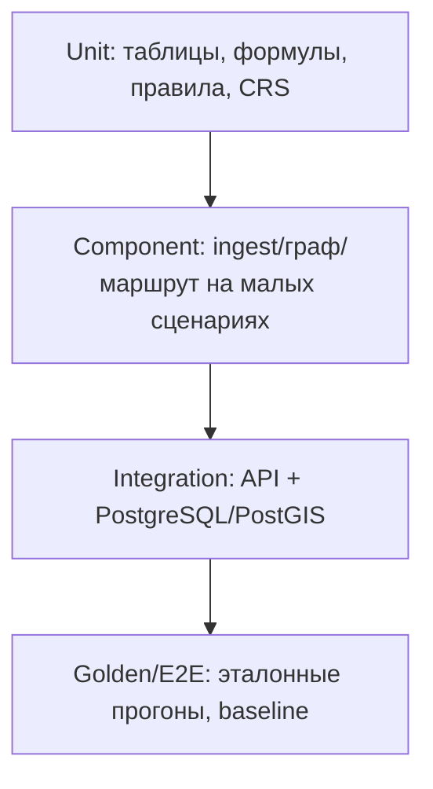

# Стратегия тестирования

Цель — гарантировать соответствие обязательным правилам и устойчивость
на другом наборе (NFR-09, NFR-10). Тесты должны быть быстрыми и
детерминированными.

## 1. Пирамида тестов

| Уровень | Что проверяем | Инструменты |
|---------|---------------|-------------|
| Unit | Таблицы Ду/стоимости, подбор Ду, предельная длина, формулы стоимости и `S`, правила ограничений, CRS | JUnit 5 |
| Component | Разбор GeoJSON, граф сети, модель препятствий, построение маршрута на малых сценариях | JUnit 5 + JTS |
| Integration | API загрузка→расчёт→выгрузка; работа с PostgreSQL/PostGIS | MockMvc, Testcontainers |
| Golden/E2E | Полный прогон на эталонном наборе, сравнение ключевых показателей | JUnit 5 |

## 2. Обязательные проверки (правила ТП)

- Подбор Ду: минимальный, одновременно удовлетворяющий расходу и предельной
  длине (FR-43).
- Предельная длина по каждому непрерывному пути; общий участок учитывается в
  каждом пути; параллельные ветви не суммируются (FR-44, FR-47).
- Камера/технический узел без смены Ду отсчёт не сбрасывает; смена Ду — сбрасывает (FR-45).
- Ду не возрастает к точке подключения (FR-48).
- Стоимость участка: `L·cнов(Ду)·Kгл·Kспец` (FR-70).
- Присоединение через камеру: ≤10 м и свободные примыкания → существующая;
  иначе новая (FR-22); отдельного `tie_in` нет (FR-33).
- Примыкания камеры ≤4; проходная линия = 2 (FR-26).
- Стоимость новой камеры включает присоединение; врезка в существующую —
  5 000 000 за участок (FR-72, FR-73).
- Штраф: `100e6 + 500000·G` (FR-74).
- Ранжирование `S` по `new_network_length` и порядок вариантов (FR-76).
- Отсутствие самопересечений новых участков и замкнутых маршрутов (FR-24, FR-29).
- Выход: только собственные атрибуты типа; `depth_* = null` в 2D;
  ровно одна `variant_summary` на вариант (FR-79).
- Спецпроход одним прямым участком; `technical_node` на границах (FR-52).
- Угол: линия — от геометрии, полигон — в точке входа (FR-53).
- Внутри разрешённого спецпересечения минимальное расстояние не проверяется (FR-55).
- Наложение спецпроходов: максимальный `Kспец`, без перемножения (FR-54).
- `railway` — запрет; `oks` — запрет 5/7/9 (FR-57).
- Финальный прямой участок в `oks`-полигоне (FR-32).
- Округление расстояний вверх (FR-58, допущение).
- Тип ID сохраняется в `unconnected_oks_ids` (FR-84).
- Доп. `properties` в выводе допускаются и игнорируются (FR-85).

## 3. Негативные тесты

- Отсутствуют обязательные поля → понятная диагностика.
- Неизвестный `object_type`/`restriction_type` → диагностика, расчёт продолжается.
- Устаревшие поля (`oks_future`, `upstream_object_id` и т.п.) → игнорируются.
- Невалидная геометрия на входе → диагностическая ошибка без падения.
- Расход превышает максимальную пропускную способность.
- Маршрут не найден для отдельной точки → частичный результат.
- Намеренное неподключение доступной точки не допускается (FR-77).

## 4. Свойства и надёжность

- Детерминизм: одинаковый вход → одинаковый выход (при том же seed).
- Производительность: вход до 3 ГБ, вывод до 500 МБ в пределах памяти.
- Изоляция: сбой одного ОКС не влияет на остальные.

## 5. Соглашения

- Имена тестов: `methodUnderTest_condition_expected`.
- Тестовые данные — маленькие рукотворные GeoJSON в `src/test/resources`.
- Интеграционные тесты с БД — через Testcontainers (`docker.io/postgis/postgis`).
- Эталонные наборы не коммитить, если они большие; использовать усечённые
  фрагменты и/или внешнее хранилище.
- `mvn test` должен проходить без внешней БД (веб/юнит-срезы).
- `mvn verify` может включать интеграционные тесты.

## 6. Покрытие

Ориентир — не менее 80 % для модулей `hydraulics`, `cost`, `geometry` и
конфигурации правил. Для API/склейки — функциональные сценарии.

## 7. Реализовано и бенчмарки

Исторические прогоны, baseline-числа и эксперименты (M1–M2, свипы,
регрессы) вынесены в отдельный документ [test-baselines.md](test-baselines.md),
чтобы стратегия оставалась краткой.

## 8. История изменений

| Дата | Изменение | Автор |
|------|-----------|-------|
| 2026-09-16 | Первоначальная версия | команда |
| 2026-09-16 | Проверки по протоколу встречи | команда |
| 2026-09-19 | Раздел о тестах M1 и ручной проверке API | команда |
| 2026-09-19 | Ревизия по ТП v2: обновлён список обязательных проверок, удалены тесты реконструкции и удорожания углов, добавлены тесты v2; 56 тестов | команда |
| 2026-09-19 | Добавлен раздел о тестах M2 (фазы A–F), 59 тестов без внешней БД | команда |
| 2026-09-19 | ADR-0027: быстрый сквозной тест на фикстуре по умолчанию, полный набор — тег slow; тесты реестра алгоритмов | команда |
| 2026-09-21 | ADR-0034: проверки вывода единого леса (`grid-forest`) на фикстуре | команда |
| 2026-09-21 | Добавлен свип мета-параметров `AlgorithmParameterSweepTest` (Spring + PostGIS/Testcontainers, отчёт в `target/algorithm-sweep/`) | команда |
| 2026-09-21 | `PostgisCellStoreTest`: проверка свежести TEMP-страниц при переиспользовании соединения из пула | команда |
| 2026-09-21 | Дефолты по run-28: `AppPropertiesDefaultsTest` (fast) и baseline-регресс `CalculationPipelineSlowTest` | команда |
| 2026-09-22 | Baseline переснят после локального ремонта поворотов; добавлен регресс зигзагов (≤12 вершин на участок) | команда |
| 2026-09-22 | ADR-0035: переснят baseline (выбор клетки входа `nearest`); регресс присоединения точки 6 к `br_0_11` | команда |
| 2026-09-22 | ADR-0035 (доп.): baseline с переприсоединением (`S` 13.0691); геометрический регресс ребра к точке 6 (< 60 м) | команда |
| 2026-09-22 | Свип v2 (угол 90°) `AlgorithmParameterSweepV2Test`; `multiEntry=true` дефолтом, baseline `S` 12.8104 | команда |
| 2026-09-22 | ADR-0038: baseline после refine-после-relink (`S` 13.5299, длина 1918.43 м); обновлён порядок этапов | команда |
| 2026-09-22 | ADR-0039: baseline relink с выходами-кандидатами (`S` 12.3063, длина 1730.80 м); регресс общей камеры 3/6/8 | команда |
| 2026-09-22 | ADR-0040: baseline с фильтром выходов (`S` 13.0990, длина 1863.73 м); `permissiveExitProperties` для fast-фикстур | команда |
| 2026-09-22 | ADR-0041: baseline на гекс-сетке (`S` 12.9730, длина 1836.49 м); A/B `GridShapeExperimentTest` | команда |
| 2026-09-22 | `AppPropertiesEnvBindingTest` (поле ↔ env); дефолт ячейки 1.0, baseline `S` 13.7065 | команда |
| 2026-09-22 | `forest-relink-exit-relocation=false` по умолчанию; baseline `S` 14.3207; консолидация 3/6/8 — отдельный slow-тест опции | команда |
| 2026-09-22 | ADR-0043: relink без углов маршрута, refine чинит углы; baseline `S` 14.1533; 1/2 на одной камере | команда |
| 2026-09-22 | Bugfix: проверка отсутствия тупиковых узлов в `refine.geojson`; baseline `S` 14.0520 | команда |
| 2026-09-22 | ADR-0044: эксперимент `RelinkNodesExperimentTest`; контроль степени FR-26; baseline `S` 14.0512 | команда |
| 2026-09-22 | ADR-0044 включён по умолчанию (`S` 13.3512); порог вершин 15; сквозная нумерация id | команда |
| 2026-09-29 | Исторические прогоны вынесены в test-baselines.md | команда |
