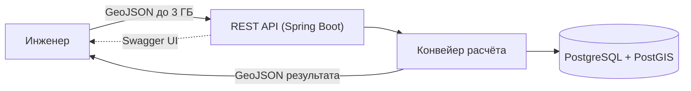
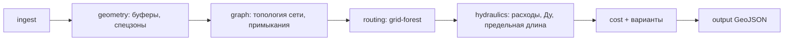
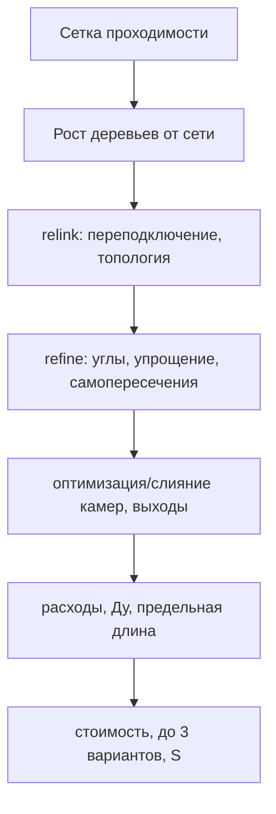
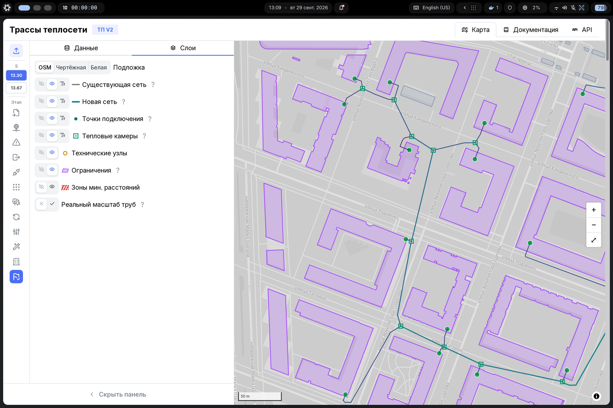
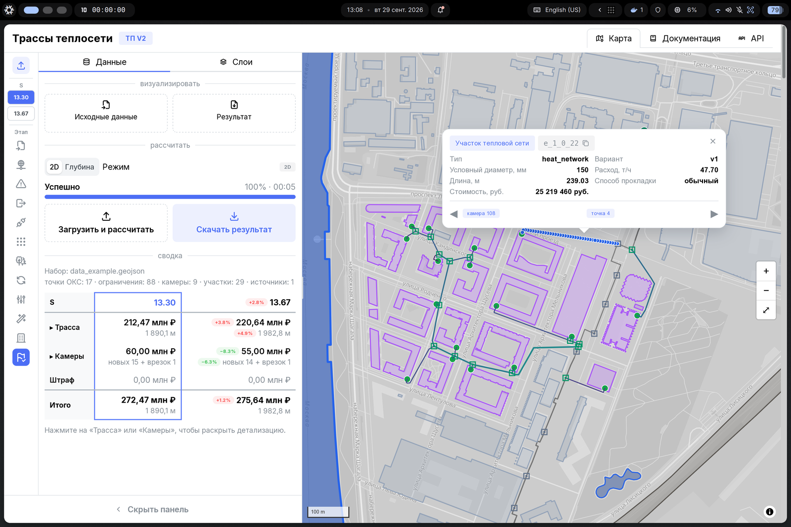
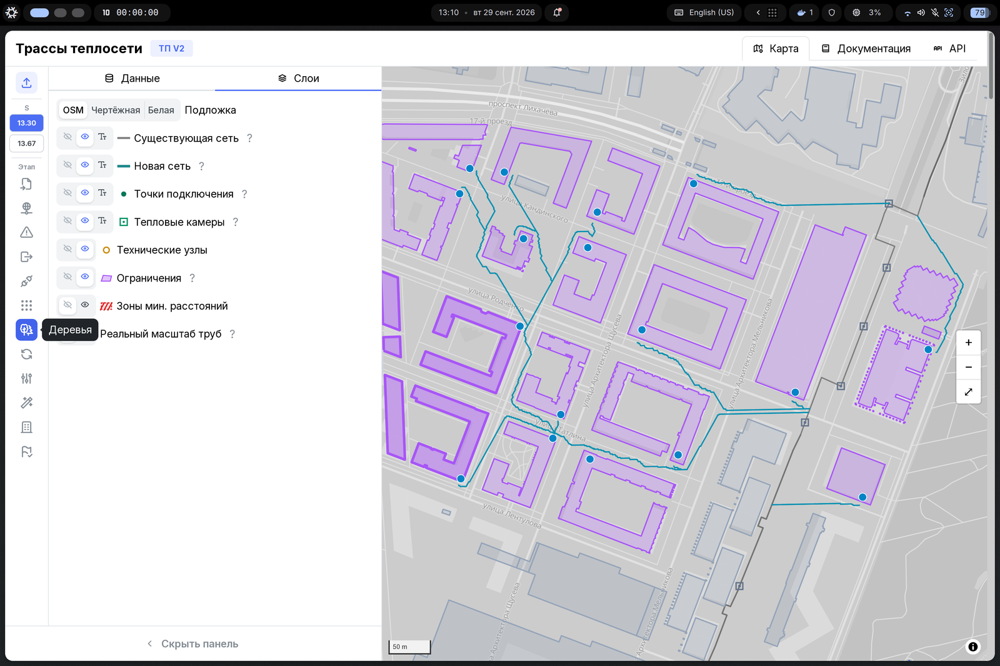

# Пояснительная записка (для жюри)

Краткое описание решения задачи «Построение трасс подключения перспективных
ОКС к существующей тепловой сети». Полные правила и обоснования — в
[docs/index.md](../index.md).

## 1. Задача и результат

На вход подаётся один совмещённый GeoJSON (объекты базовых типов, ОКС — как
ограничение `oks`). Сервис за один запуск:

1. выбирает места присоединения к существующей сети **через тепловую камеру**
   (существующую по правилу 10 м либо новую);
2. строит новую сеть прямыми участками, в т.ч. с общими стволами для нескольких
   точек и ветвлениями только в камерах (≤4 примыканий);
3. учитывает пространственные ограничения (запреты и спецпроходы с `Kспец`);
4. считает расходы, подбирает минимальный Ду совместно с предельной длиной по
   непрерывным путям;
5. рассчитывает стоимость и формирует **до трёх** содержательно разных вариантов
   с ранжированием по показателю `S`;
6. выгружает один GeoJSON (`heat_network`, `heat_chamber`, `technical_node`,
   `variant_summary`).

Результат корректен и на частичном наборе: неподключённые точки перечисляются в
`unconnected_oks_ids` с сохранением типа ID.

## 2. Архитектура



Конвейер (headless, офлайн):



- **Стек (обязательный по ТЗ):** Java 11, Spring Boot 2.6.3, Spring Data (JPA),
  Maven, PostgreSQL + PostGIS, springdoc-openapi-ui 1.7.0, docker-compose.
  Геометрия — JTS, преобразование CRS — Proj4J (EPSG:4326 → EPSG:32637).
- **Потоковость:** вход разбирается стримингом (Jackson), выгрузка — потоковая;
  режим партиционирования входа (`forest-partition-tile-m`) для крупных наборов.
- **Офлайн:** внешних сервисов нет; визуализатор — опционально и вне оцениваемой
  поставки.

## 3. Алгоритм

Основной алгоритм — `grid-forest` (ADR-0034): рост леса от существующей сети по
сетке проходимости (многоисточниковый Дейкстра), затем топология (камеры,
общие стволы), переподключение (relink), ремонт геометрии (refine),
оптимизация положения камер, разрешение самопересечений. Подбор Ду и стоимости
точен; маршрутизация — детерминированная эвристика.



Дополнительно (необязательно) реализован **режим глубины M4** (ADR-0073):
отдельный запуск `mode=depth`, вертикальный профиль (спуск/полка/возврат,
уклон ≤0,10, `Kгл`), `depth_start`/`depth_end`, техузлы на границах. См.
[algorithm.md §12](../03-architecture/algorithm.md).

## 4. Развёртывание и проверка

```bash
docker compose up --build -d      # сервис + БД, офлайн
# Swagger UI: http://localhost:8080/swagger-ui.html
```

Либо без Docker: `make db-up && make run` (Maven Wrapper `./mvnw`). Полный набор
команд — `make help`; инструкция — [README](../../README.md).

Проверка качества: `make test` (быстрые), `make test-slow` (эталонные прогоны),
`mvn -B verify`; инварианты ТП v2 (самопересечения, углы, степень, выходы ОКС)
проверяются на эталонных наборах.

### Визуализатор (опционально)

Результат можно посмотреть в опциональном визуализаторе (`frontend/`, вне
оцениваемой поставки): карта входа и результата, параметры объектов, сводка и
сравнение вариантов, промежуточные этапы алгоритма.







## 5. Соответствие ТП v2

- присоединение только через камеру, отдельного `tie_in` нет (FR-22, FR-33);
- примыкания ≤4, проходная линия = 2 (FR-26);
- Ду + предельная длина по непрерывным путям, без завышения (FR-43…FR-48);
- спецпроход одним прямым участком, угол, `Kспец` (FR-52…FR-57);
- финальный прямой участок в `oks` (FR-32);
- стоимость, штрафы, `S`, до трёх вариантов (FR-70…FR-76);
- реконструкция не выполняется (ТП v2, разъяснение 14).

## 6. Ограничения и развитие

- Полный гидравлический расчёт и мощность источника не моделируются.
- Режим глубины — отдельный необязательный; интеграция глубины в поиск пути —
  следующий шаг (E9-05).
- Направления развития: PostGIS-спилл сетки для сверхкрупных наборов,
  единая оценка S, расширение набора проверочных тестов.

## 7. История изменений

| Дата | Изменение | Автор |
|------|-----------|-------|
| 2026-09-29 | Первоначальная версия | команда |
| 2026-09-29 | Добавлены скриншоты визуализатора; ссылка на лицензии | команда |
